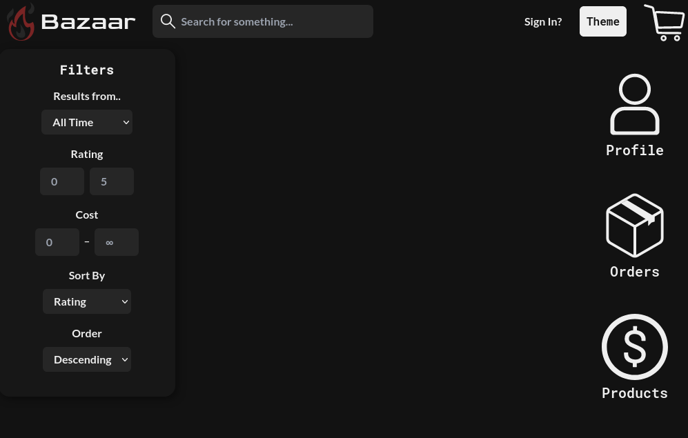
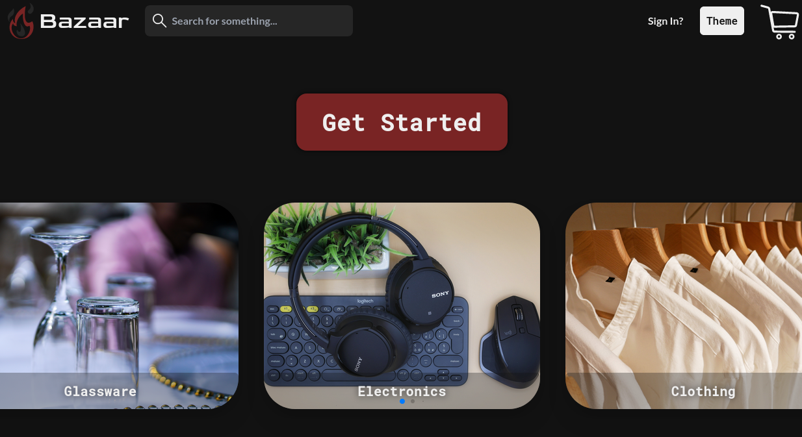

# Bazaar


Homepate             |  Product Page
:-------------------:|:--------------------:
  |  
___
## Description
This is just a very basic webshop with all needed features. It is build with nestjs

Simple Webshop with NestJS, TypeScript, and React

# This repository contains a simple webshop application built with TypeScript, NestJS, and React.
NestJS is a server-side framework for building scalable, efficient, and reliable applications, while React is a popular 
library for building user interfaces. TypeScript enhances JavaScript by adding static types, which improve developer 
productivity and code quality.
___

## Installation and Setup
To set up the application, clone the repository and install the required dependencies:
```angular2html
git clone https://github.com/Emelit0/webshop.git
cd webshop
npm install
```

>Make sure to have the compatible version of nodejs and npm installed. Also create a .env from the .env.example
file in both the client and server folders. The .env file in the server folder should contain the database connection
string & jwt_secret and the .env file in the client folder should contain the API URL.

## Running the Application
We first need to startup the database:
```angular2html
docker-compose up
```

To run the application, use the following command:
```angular2html
npm run start
```
Now you should be good!
___


